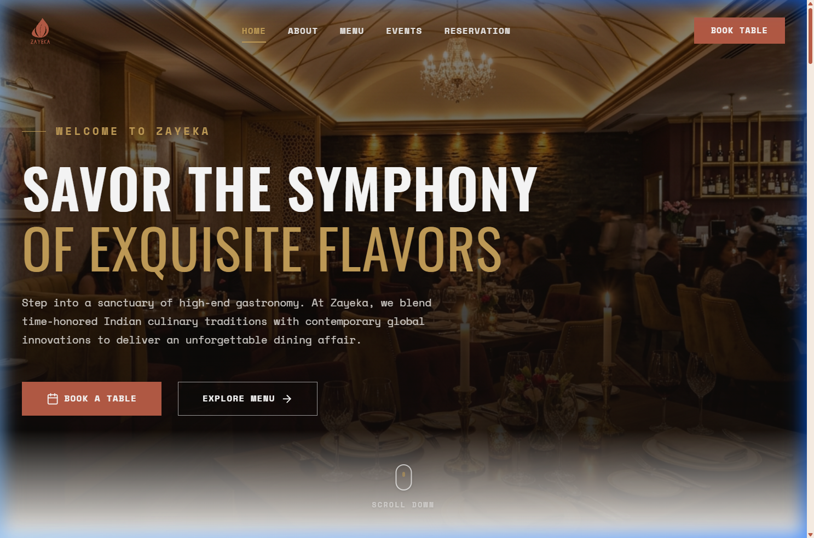

# Zayeka | Fine Dining & Indian Fusion Cuisine



Zayeka is a high-end, premium MERN stack web application designed for a luxury Indian-European fusion restaurant. It features a stunning customer-facing landing page, an interactive table booking wizard, invitational event RSVPs, and a digital receipt system. It also includes a dedicated **Reception Desk Console** for restaurant hosts to manage reservations and event admissions in real-time.

---

## 🍽️ Features

### Customer Experience
*   **Gourmet Interactive Menu**: Explore 24 curated dishes categorized by course, dietary preferences (Vegan, Vegetarian, Gluten-Free), and chef recommendations.
*   **Interactive Seating Map**: Select specific dining tables (VIP Booths, Window Seating, Main Hall) with real-time capacity validation.
*   **Pre-Selected Culinary Planner**: Add dishes directly to your dinner selection during booking.
*   **Invitational Event RSVP**: Apply for premium restaurant experiences (e.g., wine tastings, masterclasses) with custom requirements.
*   **Digital Pass & Receipts**: Scan-ready QR codes and print-optimized transaction receipts.

### Reception Desk Console (`/desk`)
*   **Real-Time Status Management**: Check-in or cancel table reservations and event registrations.
*   **Smart Indicators**: Clear markers for VIP seating, special occasions (Birthdays, Anniversaries, Date Nights), and pre-selected dishes.
*   **Instant Ticket Lookup**: Click on any reference code badge (e.g., `ZYK-59W46Q`) to instantly load and display the guest's digital pass or receipt.
*   **Live Metrics**: Visual counters tracking total covers, active events, and checked-in guests.

---

## 🏗️ Project Architecture

The project is structured as a **MERN Monorepo** for easy development and deployment:

```
zayeka/
├── backend/            # Express.js Server & MongoDB Models/Routes
│   ├── config/         # Database configuration (Mongoose)
│   ├── models/         # Mongoose Schemas (MenuItem, Reservation, EventRSVP)
│   ├── routes/         # REST API Endpoints
│   ├── seeds/          # Database seeding scripts
│   └── server.js       # Backend entry point
│
├── frontend/           # Vite + React Client
│   ├── public/         # Static assets & Desk Portal
│   │   └── desk/       # Pure JS/CSS Reception Desk Console
│   └── src/            # React Components & Styling
│
├── package.json        # Root package.json (Concurrently orchestration)
└── README.md           # Documentation
```

---

## 🚀 Getting Started

### Prerequisites
*   [Node.js](https://nodejs.org/) (v16+ recommended)
*   [MongoDB](https://www.mongodb.com/try/download/community) (Local instance running on `mongodb://127.0.0.1:27017/zayeka` or a MongoDB Atlas URI)

### 1. Installation
Clone the repository, navigate to the root directory, and install all dependencies:
```bash
npm install
```
*(This will automatically trigger a post-install script to install dependencies for both the `/frontend` and `/backend` folders)*.

### 2. Configure Environment Variables
Create a `.env` file inside the `/backend` directory:
```env
PORT=5000
MONGO_URI=mongodb://127.0.0.1:27017/zayeka
NODE_ENV=development
```

### 3. Seed the Database
Seed the MongoDB database with the 24 artisanal menu items and high-resolution Unsplash URLs:
```bash
npm run seed
```

### 4. Run the Application
Start both the backend server and frontend development server concurrently:
```bash
npm run dev
```

Once running:
*   **Customer Landing Page**: `http://localhost:5173/`
*   **Reception Desk Console**: `http://localhost:5173/desk/`
*   **Backend REST API**: `http://localhost:5000/api`

---

## 🛠️ Scripts Reference

All scripts should be run from the **root** directory:

| Script | Description |
| :--- | :--- |
| `npm run dev` | Runs frontend and backend servers concurrently in development mode |
| `npm run seed` | Seeds the MongoDB database with the initial menu items |
| `npm run backend` | Starts the Express server using Nodemon |
| `npm run frontend` | Starts the Vite React development server |
| `npm run build` | Builds the frontend production bundle |
| `npm install` | Installs dependencies for root, backend, and frontend |
